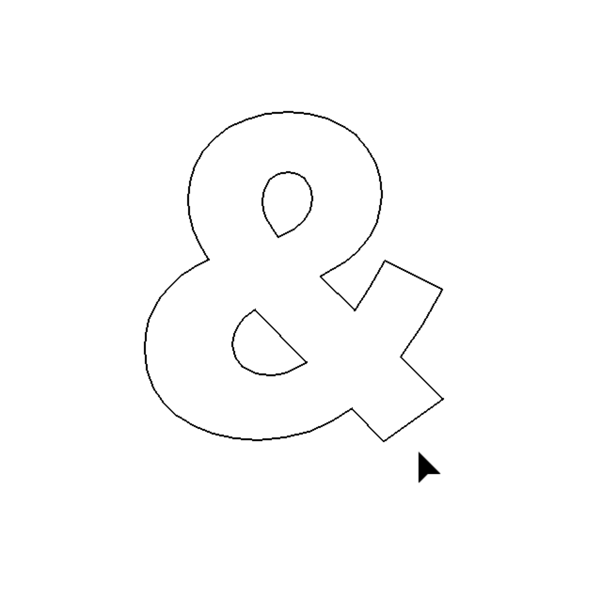
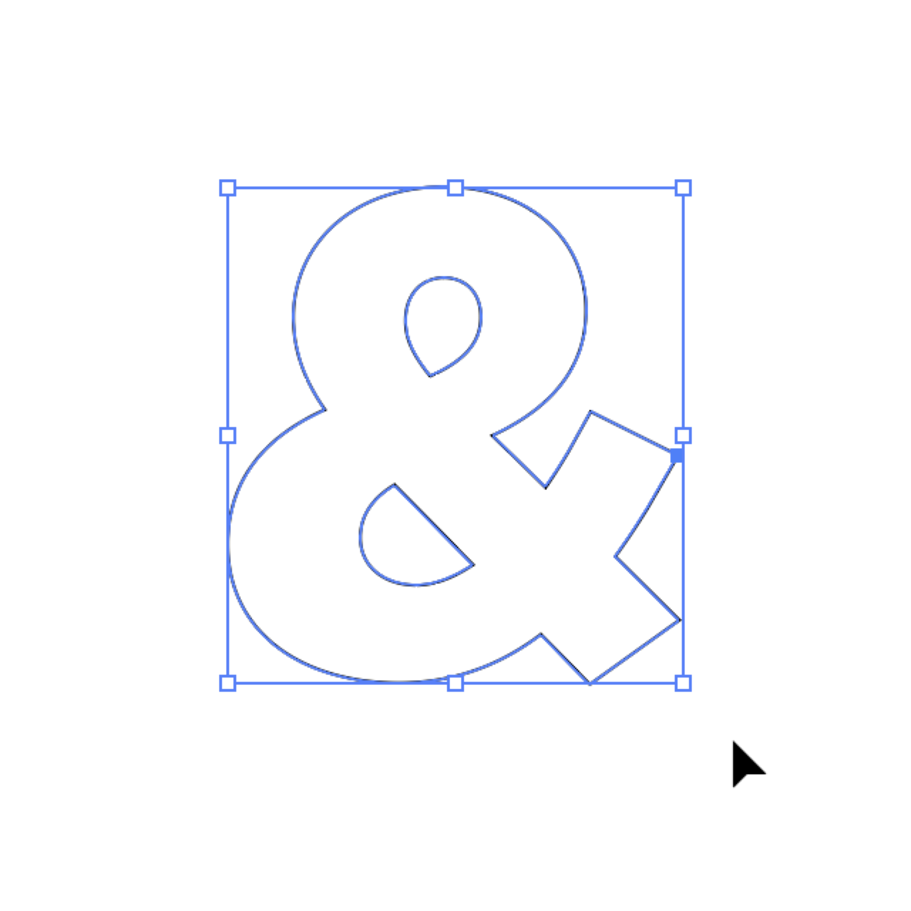
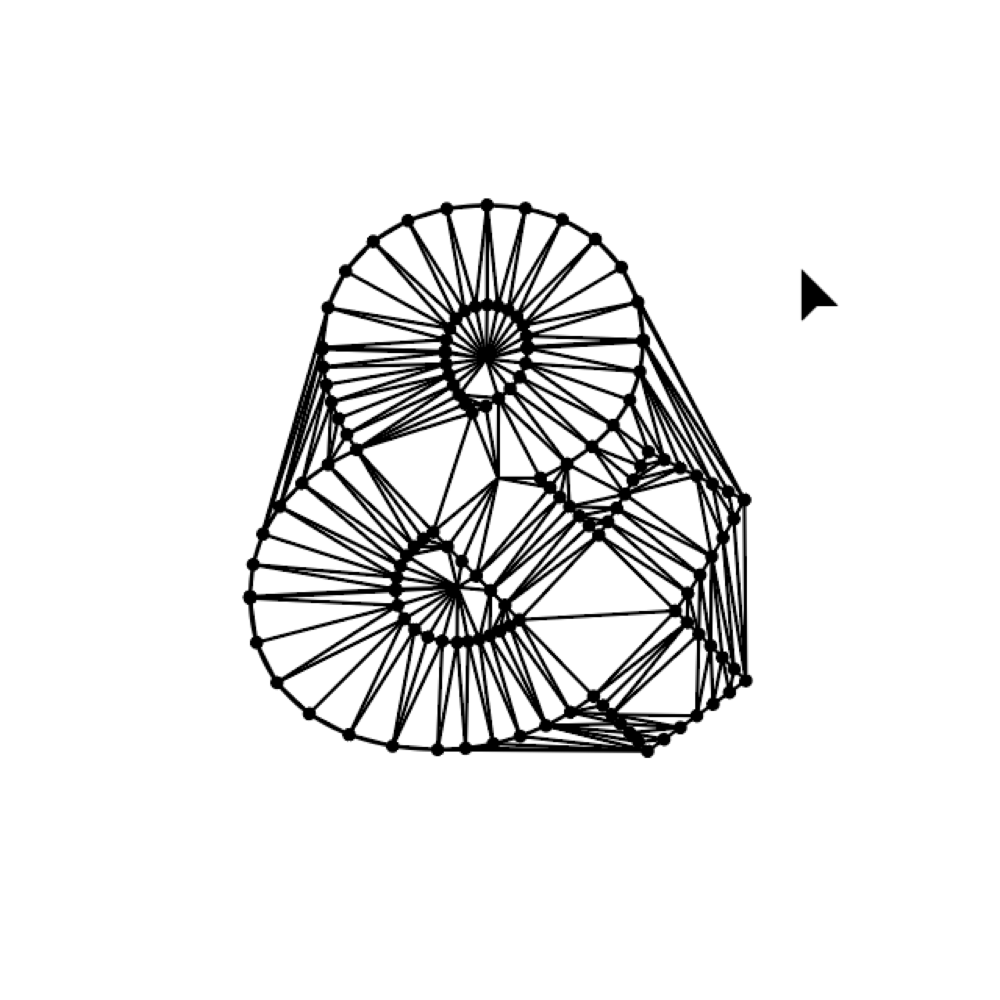

# spatial-mapping-like
## yamac-spatial-mapping-like.jsx
Microsoft HoloLensのSpacial Mapping風ビジュアルをドロネー三角形分割を利用して作成する、Adobe Illustrator用スクリプトです。

### 使い方
#### 1.任意の図形を用意する  
  

#### 2.任意の図形を用意する  
  

#### 3.任意の図形を用意する  
  

#### 4.任意の図形を用意する  
  

---
**このスクリプトはHiroyuki Satoさん作のスクリプトを元にしています。**  
http://github.com/shspage  
Licensed under The MIT License

**ironwallabyさん作の'delaunay.js'をincludeする必要があります。**   
以下よりダウンロードし、このスクリプトと同じディレクトリに格納してください。  
https://github.com/ironwallaby/delaunay  
Licensed under CC0 1.0 Universal (CC0 1.0)

---
Copyright 2018 *Haruki Yamazaki  
This script is distributed under the MIT License.  
See the LICENSE file for details.
