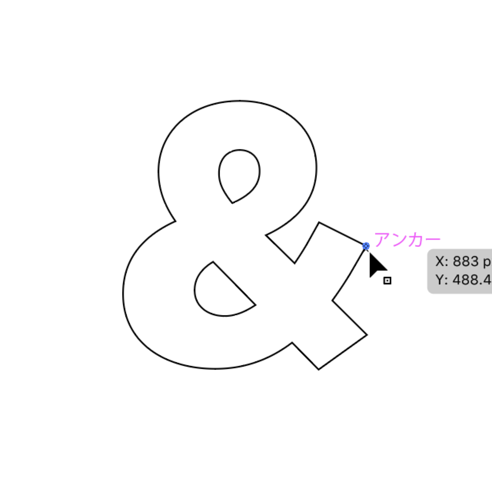

# spatial-mapping-like
## yamac-spatial-mapping-like.jsx
Microsoft HoloLensのSpacial Mapping風ビジュアルをドロネー三角形分割を利用して作成する、Adobe Illustrator用スクリプトです。

### 使い方
#### 1.任意のイラストレーションを用意する  
- イラストレーションは複数のパスで構成されていても大丈夫です（開いたパスでも可）
- 文字はアウトライン化を行ってください  
  

#### 2.「ドロネー点」（アンカーポイント）に配置する図形をイラストレーションの最前面に重ねる
- ドロネー点用図形は円以外でも大丈夫です。（イラストレーションに対してあまり大きくないほうが良いと思います）
  

#### 3.ドロネー三角形分割したいイラストレーションとドロネー点図形を選択し、スクリプトを実行する
- 「ファイル」メニュー > 「スクリプト」 > 「その他のスクリプト…」 > 「yamac-spatial-mapping-like.jsx」を選択
  

#### 4.ドロネー三角形分割されたイラストレーション  
 
  
  
---
**このスクリプトはHiroyuki Satoさん作のスクリプトを元にしています。**  
http://github.com/shspage  
Licensed under The MIT License

**ironwallabyさん作の'delaunay.js'をincludeする必要があります。**   
以下よりダウンロードし、このスクリプトと同じディレクトリに格納してください。  
https://github.com/ironwallaby/delaunay  
Licensed under CC0 1.0 Universal (CC0 1.0)

---
Copyright 2018 *Haruki Yamazaki  
This script is distributed under the MIT License.  
See the LICENSE file for details.
